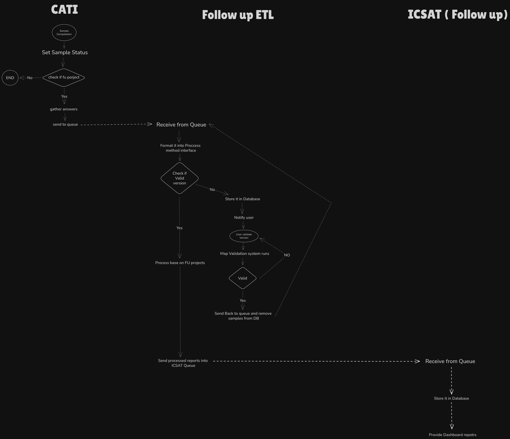

# Follow up design

## Goals

Implement a system that **automatically reads and transforms data** from our transactional app (**CATI**) and displays reports **live** in **ICSAT** under a new project named **Follow up**.

This system should have the **capability** to **add**, **update**, and **remove** **CATI projects** from the flow **by regular users**, without requiring development team support.

The system must support **high availability** and experience **minimal to no downtime**.

It should be **flexible** enough to **connect to a new CATI** instance in case of updates.

It should also include a **vision** for future application needs with similar functionality.

## Architecture Overview

Our design approach is to create an **ETL pipeline** that **sits between CATI and ICSAT**, which we call **Follow up ETL**.

Users can configure which CATI projects should be included in Follow up and define how each project's **questions** and **choices** should be processed and passed to Follow up reports.

We use a **labeling system** that allows users to map and identify CATI data (projects, questions, choices, etc.) for the Follow up ETL.

We also use **queue systems** to pass data between system components.

### **System Components**

* **CATI**
  * **Responsibilities**:
    * Provide completed sample data with answers required by the Follow up system and send it to the queue.
  * **Data flow**:
    * On each sample status update, the system checks whether the sample is part of a Follow up project (this info exists in both the main DB and ETL DB). If it is, it gathers the answers, structures them, and sends them to the queue.

* **Follow up ETL**
  * **Responsibilities:**
    * Receive samples and answers, process them (organize answers into meaningful criteria and sections in the correct format for ICSAT), and load the processed data into ICSAT.
    * Validate CATI project versions.
    * Implement a labeling and mapping system (configurable via a CRUD interface).
    * Sync required Follow up projects with CATI.
  * **Data flow:**
    * Receive data from the queue. Check the CATI project version to verify if it's valid (each update to a CATI questionnaire creates a new version, initially considered invalid). If invalid, exclude the sample from processing and notify users. Users can later validate the new version and reintroduce it into the processing flow.
    * Process the data and load it into ICSAT.

* **ICSAT (Follow up)**
  * **Responsibilities**:
    * Receive processed data and display it in user dashboards.
    * Perform aggregations if needed.
  * **Data flow**:
    * Receive data from the queue and store it in the database for dashboard use.

