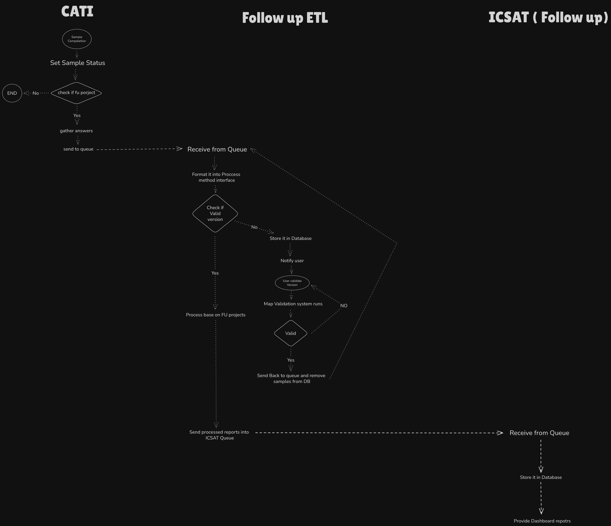

# Follow up design

## Goals

Implement system that **automatically read and transform data** from our transactional app (**CATI**) and show reports **live** in **ICSAT** as new project named **Follow up**

this system should have **ability** to **remove**, **update**, **add new** **projects** (cati projects) to it flow **by simple users** and not dev team support

system should support **high availibility** and almost **no downtimes**

this system should be **flexible** to be able to **connect to new CATI** in case of update

have some **vision** in designing for **futue app** need like this

## Architecture Overview

Our overview for this design was that we create some kinda **ETL** that **sits between CATI and ICSAT** which we named **Follow up ETL**

Users can config that which projects of CATI should go into Follow up and also config each of it quesitons and choices for be able to proccessed and pass to follow up reports

We use some kina label system that users can use to map and identify CATI info (projects, questions, choices and etc) for FollowUpETL

We use Queue systems for passing data between nodes of system

### **System Components**

* **CATI**
  * **Responsibilities**:
    * Provide compeleted sample information that follow up needs with it's answers and send to queue
  * **Data flow**:
    * in each set sample status we check with if this sample is for Follow up projects (we have this data in our DB and also in ETL DB) and then gather answrs of sample and sturcture it and send it to queue
* **Follow up ETL**
  * **Responsibilities:**
    * Receive Sample & Answers and process it (put answers in meaning full criteria and sections with currect format for icsat) and load(send) proccessed data to ICSAT
    * Validate sample poject version
    * Implement lable system and mapping system (configurable with CRUD system)
    * Sync Follow up needed projects with CATI
  * **Data flow:**
    * Receive data from queue, Check CATI Project version to see if it valid version or not (each update of questionnair in cati produce new version and it will consider as invalid version) and take out samples from being porcessd so users (users will be notify about that some invalid version has come) later on can check new new version and valid it  and send it back to flow
    * Proccess Data and load it to ICSAT
* **ICSAT(Follow up)**
  * **Responsibilities**:
    * Receive proccessed data and show it in dashboards for users
    * Do some aggregations if needed
  * **Data flow:**
    * Receive data from queue and store it in it's database for dashboards

